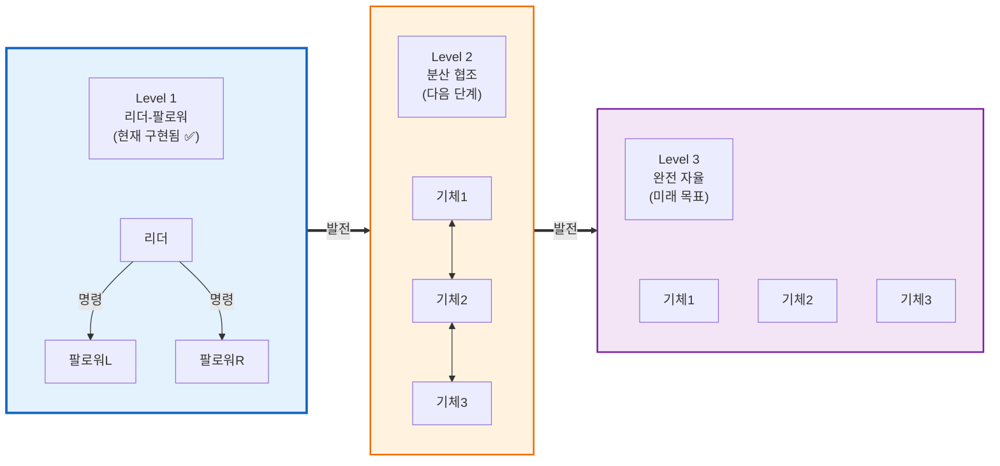

# Humiro Fire Suppression - 프로젝트 마스터 플랜 v5.0

작성일: 2025-12-31
**최종 수정일**: 2026-02-18
**소프트웨어 버전**: v0.19.3
**상태**: 편대 비행 + GPIO 격발 구현 완료, 실비행 튜닝 단계

---

## 군집 드론 자율성 로드맵



### Level 1: 리더-팔로워 (현재 구현됨) ✅
| 기능 | 상태 | 설명 |
|-----|------|------|
| 편대 비행 | ✅ 완료 | 리더 위치 기준 오프셋 적용 (right/behind/above) |
| 상태 동기화 | ✅ 완료 | IDLE → FOLLOWING → SUPPRESSING → HOLD → RTL |
| 횡단 방지 | ✅ 완료 | Cross-track 클램프 + SUPPRESS 미러링 |
| DDS 도메인 분리 | ✅ 완료 | FC Bridge IPC (FC: Domain 0, 편대: Domain 1) |
| 충돌 방지 | ✅ 기본 | CollisionAvoidance 기본 구현 |
| GPIO 격발 | ⚠️ 70% | 소프트웨어 완료, HW 검증 대기 |
| Gate 동기화 | ⏳ 미구현 | Gate 4 (SUPPRESS→RTL) |
| Fail-safe | ✅ 완료 | 리더 통신 끊김 시 hover → RTL |

### Level 2: 분산 협조 (다음 단계)
| 기능 | 설명 |
|-----|------|
| 상호 위치 공유 | 리더 없이 P2P 통신 |
| 위치 협상 | 도착 순서에 따른 자동 배치 |
| 충돌 회피 | 회피 경로 생성 알고리즘 |
| Mesh 통신 | 분산 네트워크 구성 |

### Level 3: 완전 자율 (미래 목표, 계획 제외)
| 기능 | 설명 |
|-----|------|
| 자율 위치 선정 | 최적 경로 및 위치 계산 |
| 상황 적응 | 화재 확산, 바람 등 동적 대응 |
| 분산 합의 | 독립적 의사결정 알고리즘 |

---

## 프로젝트 개요

**목적**: 드론 기반 자동 소화 시스템 (3대 편대)

**핵심 프로세스**:
1. ✅ 열화상으로 화재 감지 (핫스팟)
2. ✅ LiDAR로 거리 측정
3. ✅ GCS 미션 명령 수신 (CustomMessage 60000)
4. ✅ 자율 비행 (OFFBOARD 상태머신)
5. ✅ 편대 비행 (Leader-Follower ROS2 DDS)
6. ⚠️ GPIO 격발 (소프트웨어 완료, HW 검증 대기)
7. ⏳ 핫스팟 트래킹 + 드론 정조준 (Phase 6)

**기술 스택**:
- **개발 언어**: C++17 (코어) + Python (GUI)
- **플랫폼**: Khadas VIM4 (Ubuntu 22.04 ARM64)
- **빌드**: CMake + Make + colcon
- **ROS2**: Humble + FastDDS
- **PX4**: v1.16.0 + uXRCE-DDS
- **통신**: MAVLink (GCS↔VIM4), ROS2 DDS (드론 간)

---

## 시스템 아키텍처

### 통신 구조

```
┌─────────────────────────────────────────────┐
│                   GCS (QGC)                  │
│  CustomMessage (60000-60003) via MAVLink     │
└──────────────┬──────────────────────────────┘
               │ mavlink-router (UDP 14550)
               ▼
┌─────────────────────────────────────────────┐
│           VIM4 (Leader - Drone 1)            │
│                                              │
│  ┌──────────┐  ┌─────────────┐  ┌────────┐ │
│  │CustomMsg │  │OffboardMgr  │  │Formation│ │
│  │(60000-03)│→ │(상태머신)   │← │Controller│ │
│  └──────────┘  └──────┬──────┘  └────┬────┘ │
│                       │              │       │
│                FC Bridge IPC    ROS2 DDS     │
│                (Domain 0)      (Domain 1)    │
│                       │         WiFi         │
│                       ▼              │       │
│                ┌──────────┐          │       │
│                │ PX4 FC   │          │       │
│                │(uXRCE-DDS)│         │       │
│                └──────────┘          │       │
└──────────────────────────────────────┼───────┘
                                       │
              ┌────────────────────────┼────────────────────────┐
              │                        │                        │
              ▼                        ▼                        ▼
┌──────────────────────┐ ┌──────────────────────┐
│ VIM4 (Follower L)    │ │ VIM4 (Follower R)    │
│ - LeaderPose 수신    │ │ - LeaderPose 수신    │
│ - 오프셋 추적        │ │ - 오프셋 추적        │
│ - FollowerStatus 발행│ │ - FollowerStatus 발행│
└──────────────────────┘ └──────────────────────┘
```

### MAVLink Custom Messages
```
MSG_ID 60000: FIRE_MISSION_START   (GCS→VIM4) - 미션 시작/경로 변경
MSG_ID 60001: FIRE_MISSION_STATUS  (VIM4→GCS) - 상태 보고
MSG_ID 60002: GPIO_CONTROL         (GCS→VIM4) - 격발 제어
MSG_ID 60003: FIRE_MISSION_RTL     (GCS→VIM4) - 긴급 복귀
```

### ROS2 편대 토픽
```
Leader 발행:
  /droneN/formation/leader_pose     (10Hz, BestEffort) - 위치+상태
  /formation/heartbeat              (1Hz, BestEffort)  - 연결 확인
  /formation/command                (이벤트, Reliable) - 명령 전달

Follower 구독/발행:
  /droneN/formation/leader_pose     (구독)
  /formation/heartbeat              (구독)
  /formation/command                (구독)
  /formation/follower_status        (발행, 2Hz, BestEffort)
```

---

## 화재 진압 미션 시퀀스

### 미션 상태 머신
```
IDLE → PREPARING → OFFBOARD → ARMING → TAKEOFF → HOVER → ROTATE
  → NAVIGATE → HOVER_AT_TARGET → [SUPPRESS] → RTL → LANDED → IDLE
```

### Phase 1: 미션 시작
- GCS에서 FIRE_MISSION_START (60000) 수신
- 목표 GPS 좌표, 이륙 고도, 비행 속도 설정
- OFFBOARD 모드 전환 → ARM → TAKEOFF

### Phase 2: 접근
- 목표 방향으로 Yaw 회전 (ROTATE)
- GPS 좌표로 자율 이동 (NAVIGATE)
- 감속 프로파일 적용 (DECEL_RADIUS=60m)
- LiDAR로 전방 거리 모니터링

### Phase 3: 목표 호버
- HOVER_AT_TARGET 상태
- 편대: 리더 위치 기준 오프셋 유지
- 탄약 소진 감지 (fire_gpio_index >= fire_gpio_count)
- 탄약 소진 시 2초 대기 후 자동 RTL
- 타임아웃 (30초 테스트 / 300초 운용) 시 자동 RTL

### Phase 4: 격발 (구현 중)
- GCS에서 GPIO_CONTROL (60002) 수신
- 순차 격발 (6발 최대)
- OSD 탄약 카운터 실시간 업데이트
- 6발 소진 시 자동 RTL

### Phase 5: 복귀
- RTL 명령 (PX4 내장 또는 자체 구현 예정)
- 착륙 후 DISARM → IDLE

---

## 현재 진행 상황 (v0.19.3)

### ✅ 완료 모듈

| 모듈 | 코드량 | 설명 |
|------|--------|------|
| thermal/ | 2,557 LOC | 핫스팟 감지, RGB+Thermal 정합 |
| lidar/ | 2,081 LOC | LD19 통신, 360도 스캔, SLAM 캐싱 |
| streaming/ | 1,112 LOC | RTSP/HTTP 스트리밍 |
| osd/ | 2,275 LOC | 상태 OSD, 탄약 카운터, 미니맵 |
| navigation/ | 4,772 LOC | OFFBOARD 상태머신 + 편대 + 충돌회피 |
| ros2/ | 419 LOC | PX4 상태 구독, 듀얼 구독/발행 |
| custom_message/ | 4,298 LOC | MAVLink 60000-60003 |
| application/ | 2,160 LOC | 시스템 통합 |
| gui/ | 4,975 LOC | 웹 대시보드 (Flask) |
| **총합** | **~24,800 LOC** | |

### ⏳ 미완료

| 항목 | 진행률 | 남은 작업 |
|------|--------|-----------|
| GPIO 실기체 검증 | 70% | HW 핀 출력 테스트 |
| FC 모드 편대 팔로워 | 80% | SITL 디버깅 필요 |
| Gate 4 동기화 | 0% | SUPPRESS→RTL 편대 게이트 |
| 자체 RTL 구현 | 0% | 감속 하강 RTL |
| 열원 추적 | 30% | Kalman Filter + 드론 미세 조정 |

---

## 개발 로드맵

### ✅ 완료된 Phase

- [x] Phase 1: 열화상 시스템
- [x] Phase 2: LiDAR 거리 측정
- [x] Phase 2.5: 스트리밍 시스템
- [x] Phase 2.7: 상태 모니터링 OSD
- [x] Phase 3: VIM4 자율 제어 (OFFBOARD 상태머신)
- [x] Phase 3.5: 편대 통신 (ROS2 DDS)
- [x] Phase 4: 편대 조율 (Leader-Follower)
- [x] Phase 4.5: 충돌 방지 (CollisionAvoidance)
- [x] Phase 5: GPIO 격발 + 탄약 관리 (SW 완료)
- [x] Phase 5.5: 웹 GUI 대시보드

### ⏳ 진행 중 Phase

- [ ] Phase 5 HW 검증: GPIO 실기체 핀 출력 테스트
- [ ] Phase 4 완성: Gate 4 동기화, FC 모드 팔로워 정상화

### 향후 Phase

- [ ] Phase 6: Targeting (열원 추적 + 드론 미세 조정)
  - [ ] 열원 자동 추적 (Kalman Filter)
  - [ ] 드론 위치 미세 조정 (상하좌우)
  - [ ] 정조준 판단 (LOCKED)

---

## 다음 우선순위

### 즉시 (이번 주)
1. FC 모드 편대 비행 팔로워 정상화
2. GPIO 실기체 핀 출력 테스트

### 1주일 내
3. Gate 4 (SUPPRESS→RTL) 동기화 구현
4. RTL 자체 구현 (감속 하강)

### 2주 내
5. 열원 추적 기능 (targeting/ 확장)
6. 목적지 오버슈트 실비행 튜닝

### 장기 계획
7. 분산 협조 시스템 (Level 2)

---

## v5.0 변경사항 (v4.2 → v5.0)

### 1. 편대 비행 시스템 완전 구현 (0% → 90%)
- ROS2 DDS 통신 (LeaderPose, FollowerStatus, FormationCommand, FormationHeartbeat)
- Cross-track 횡단 방지 + SUPPRESS 미러링
- DDS 도메인 분리 (FC Bridge IPC)
- 솔로/편대 모드 토글

### 2. GPIO 격발 시스템 구현 (0% → 70%)
- 순차 격발 (MSG_ID 60002)
- 탄약 카운터 (0-6발)
- 탄약 소진 시 자동 RTL

### 3. OFFBOARD 시스템 완전 리팩토링
- 핸들러 기반 상태머신 (10개 핸들러)
- 감속 프로파일 (DECEL_RADIUS=60m)
- HOVER_AT_TARGET 상태 추가

### 4. 충돌 방지 시스템 추가 (v0.16.0)
### 5. 웹 GUI 대시보드 구현 (4,975 LOC)
### 6. CustomMessage MAVLink 통합 (4,298 LOC)
### 7. SITL/FC 모드 전환 안정화
### 8. 듀얼 구독/발행 패턴 (FC/SITL 호환)

---

**작성자**: Claude Code Assistant
**버전**: v5.0
**작성일**: 2025-12-31
**최종 수정일**: 2026-02-18
**다음 리뷰**: FC 모드 편대 테스트 완료 시
